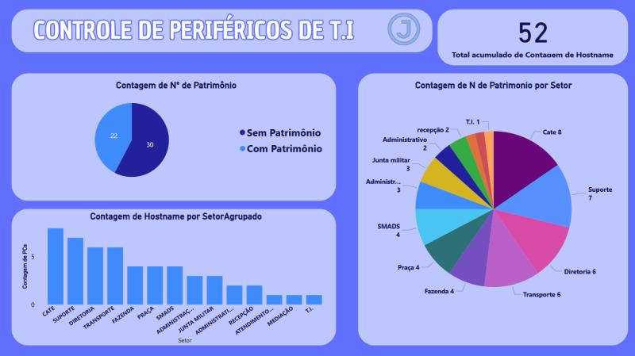

# Controle de Equipamentos de TI

## Objetivo
Este dashboard foi desenvolvido para **simular o controle de equipamentos de TI por setor**, oferecendo uma visão clara da distribuição e categorização dos ativos tecnológicos.  
Ele auxilia em rotinas internas de **inventário e gestão patrimonial**, permitindo identificar rapidamente a situação de cada equipamento.

--------------------------------------------------------------------------------------------------

## Fontes de Dados
- Arquivos de controle interno (Excel/CSV) simulando inventário de ativos.
- Estrutura de dados modelada no **Power BI** com tratamento no **Power Query**.

--------------------------------------------------------------------------------------------------

## Etapas do Projeto
1. **Coleta e Tratamento de Dados** no Power Query para padronização e limpeza.
2. **Modelagem Relacional** dos dados para permitir segmentações por setor e tipo de equipamento.
3. **Cálculos com DAX** para métricas dinâmicas, como:
   - Quantidade de equipamentos com/sem número de patrimônio.
   - Distribuição de ativos por tipo e por setor.
4. Construção do **dashboard interativo** no Power BI, com filtros e gráficos intuitivos.

--------------------------------------------------------------------------------------------------

## Principais Insights
- Identificação rápida de quais equipamentos possuem **número de patrimônio registrado**.
- Visualização da **distribuição por tipo de ativo** (notebooks, desktops, impressoras etc.).
- Categorização por **setor**, permitindo análises segmentadas.
- Apoio direto em **processos de inventário interno**.

--------------------------------------------------------------------------------------------------

##  Visualização

--------------------------------------------------------------------------------------------------

##  Ferramentas Utilizadas
- **Power BI**  
- **DAX** (medidas e KPIs dinâmicos)  
- **Power Query** (ETL e tratamento de dados)  
